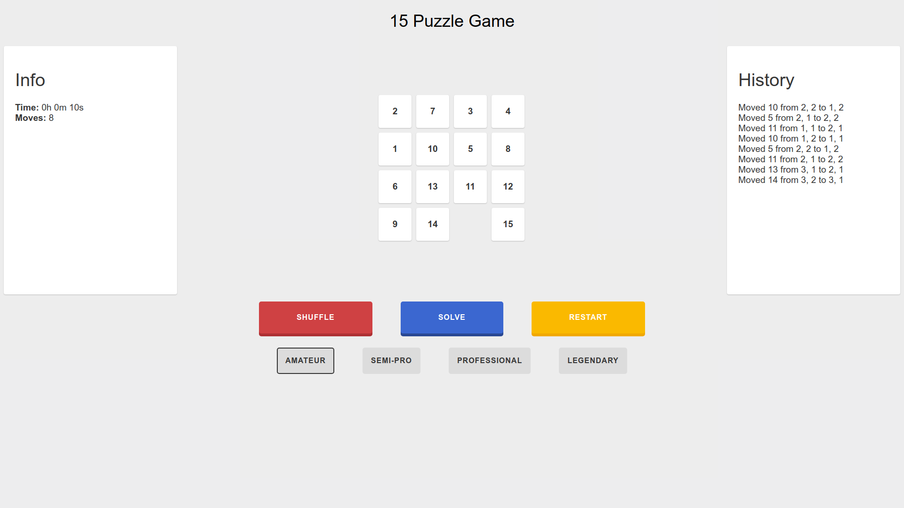
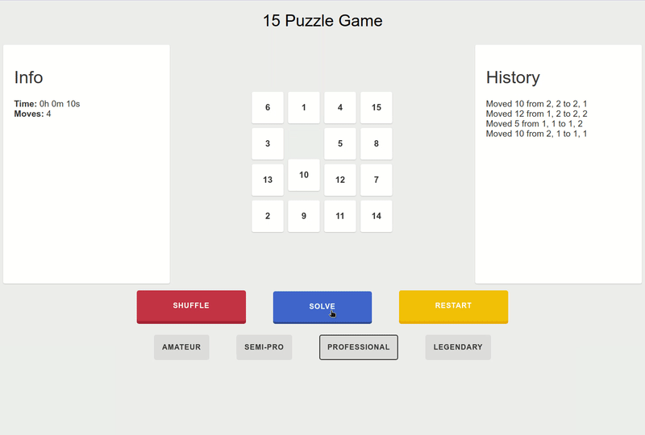
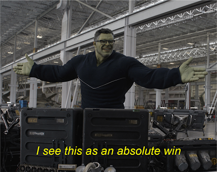
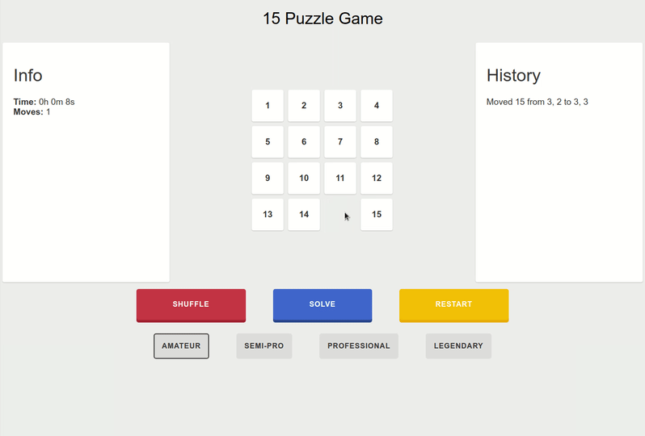
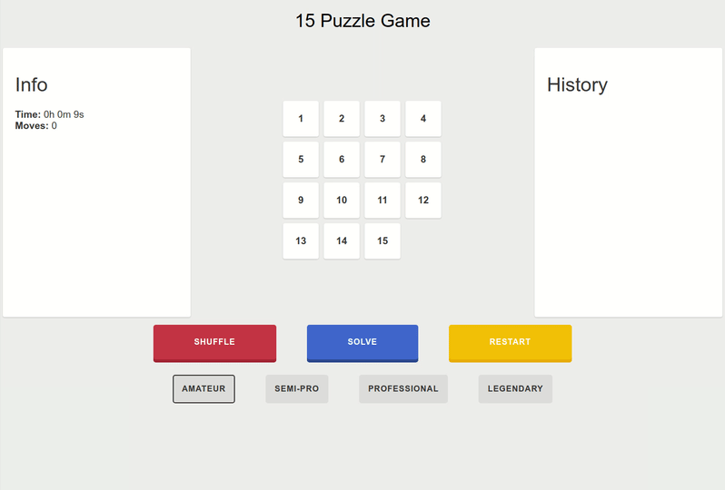

# 15 Puzzle Game

  

## Instructions

Click on number tiles to move them to adjacent empty space in grid and arrange them in order 1 to 15.

-   Press RESTART to start game
-   Press SHUFFLE to shuffle game
-   Press SOLVE to auto solve game

## How it works?

The n-puzzle is a classical problem for modelling algorithms involving heuristics. Half of the starting positions for the n-puzzle are impossible to resolve, no matter how many moves are made. ([source](https://en.wikipedia.org/wiki/15_puzzle))

To make sure every new game and every shuffle is solvable, the game tries to shuffle the board starting from the solved state itself.

## Solution

The problem of finding the shortest solution is NP-hard. [Jamie Wong](http://jamie-wong.com/2011/10/16/fifteen-puzzle-algorithm/) tries to solve this problem in browser using Tree Pruning, Las Vegas Randomization, Min-Heap Priority Queue, (Quantum Computers?) after taking [Introduction to Artificial Intelligence](https://www.ai-class.com/) course and the result is painfully slow if you shuffle the board too hard. [Try it yourself](http://jamie-wong.com/2011/10/16/fifteen-puzzle-algorithm/).

### Search of a simpler solution

Since, I wanted to implement this in a single weekend I chose a simple approach. The game stores every move in an array and just backtracks it to reach the solution. ¯\_(ツ)\_/⁻

### Result

### Optimizations

The game intelligently (AI?) backtracks it's moves to prevent repetitive to and fro of the same moves. It store all the moves in an array and truncates if a previously seen state is encountered again.

#### What won't happen

### What will happen

## Libraries Used

-   `react@16.8.6`
-   `react-redux@7.0.3`
-   Developed using `create-react-app`
-   Deployed using `gh-pages`

## Hire me to build beautiful UIs for complex problems

[@afzalsayed96](https://twitter.com/afzalsayed96)
